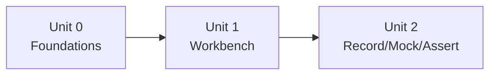
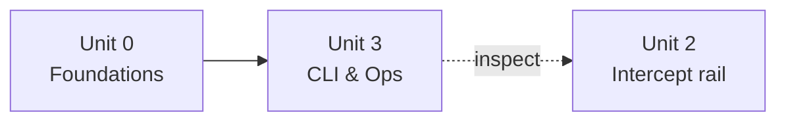
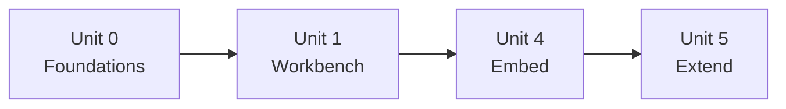

# Learning Paths

Pick a **course** based on your role. A course is a curated selection of **units** — it's pure curation (this file), not a folder. Units are the reusable building blocks; the same unit appears in more than one course, and a course takes units in whatever order fits. Or complete every unit in order for the full picture.

> **One unit = one modality.** Each unit stays in a single modality — UI, CLI, embedded coding, or extension coding — and never makes you switch mid-unit. Switching *between* units inside a course is fine (that's an explicit unit boundary). Where another modality is relevant, a unit **links** to its sibling rather than opening a second track inline.

## The units

| Unit | Modality | What it covers |
|---|---|---|
| [Unit 0: Foundations](units/unit-0/README.md) | — (concepts) | What Bowire is · the two deployment shapes · how the bootcamp works |
| [Unit 1: The Workbench — first contact](units/unit-1/README.md) | UI | Discover, invoke, multi-protocol, streaming |
| [Unit 2: The Workbench — record, mock, assert, cover](units/unit-2/README.md) | UI | Record/replay, schema mocks, Flow assertions, coverage, Intercept rail |
| [Unit 3: CLI & operations](units/unit-3/README.md) | CLI | Install, `mock`/`test`+CI, `mcp serve`, reverse-proxy, deploy, observe, workspaces |
| [Unit 4: Embed Bowire](units/unit-4/README.md) | embedded coding | `AddBowire`/`MapBowire`, embedded MCP, interceptor middleware |
| [Unit 5: Extend Bowire](units/unit-5/README.md) | extension coding | Protocol plugin, sidecar, UI extension, plugin lifecycle |

## Courses

### 1. Workbench & API operator (User)

**For:** developers, frontend engineers, QA, AI/agent operators who *use* Bowire to drive APIs.

**Units:** [0](units/unit-0/README.md) → [1](units/unit-1/README.md) → [2](units/unit-2/README.md). Cross-links into [Unit 3](units/unit-3/README.md) where a scriptable equivalent (`bowire mock` / `bowire test`) helps.

→ Capstone: [**User**](capstones/user/README.md) — a `.bww` workspace + diagnosis runbook that extends the Harbor domain.

### 2. Integrator / DevOps / Administrator

**For:** platform engineers, SREs, DevOps — anyone shipping Bowire into CI and non-laptop environments.

**Units:** [0](units/unit-0/README.md) → [3](units/unit-3/README.md). Cross-links into [Unit 2](units/unit-2/README.md) (the Intercept rail) for inspecting captured traffic.

→ Capstone: [**Administrator**](capstones/administrator/README.md) — a `docker-compose` / k8s stack + production runbook over the Harbor domain.

### 3. Developer — embed & extend

**For:** backend developers embedding Bowire, plugin authors, core contributors.

**Units:** [0](units/unit-0/README.md) → [1](units/unit-1/README.md) → [4](units/unit-4/README.md) → [5](units/unit-5/README.md). Cross-links into [Unit 3](units/unit-3/README.md) (the CLI as a verification tool).

→ Capstone: [**Developer**](capstones/developer/README.md) — ship a NuGet plugin that extends the Harbor domain.

### 4. (Optional) QA / tester

**Units:** [0](units/unit-0/README.md) → [2](units/unit-2/README.md) (assertions + coverage) → [3](units/unit-3/README.md) (`bowire test` in CI). Reuses the operator + CLI units for a testing-first path.

## Or: the full bootcamp

Complete every unit in order — [0](units/unit-0/README.md) → [1](units/unit-1/README.md) → [2](units/unit-2/README.md) → [3](units/unit-3/README.md) → [4](units/unit-4/README.md) → [5](units/unit-5/README.md) → your [capstone](capstones/).

**Prerequisites (everything):**

- [.NET 10 SDK](https://dotnet.microsoft.com/download)
- Bowire CLI: `dotnet tool install --global Kuestenlogik.Bowire.Tool` (Unit 3)
- An ASP.NET host + `dotnet add package Kuestenlogik.Bowire` (Unit 4) and `dotnet new bowire-plugin` template (Unit 5)
- Sample services from [`Bowire.Samples`](https://github.com/Kuestenlogik/Bowire.Samples) (Harbor `harbor-demo/` + per-plugin `protocols/`)
- **Claude Desktop** or **Cursor** (Unit 3.3 only) · **Python 3.10+** (Unit 5.2 only) · **Docker** (Unit 3 CI/deploy)
