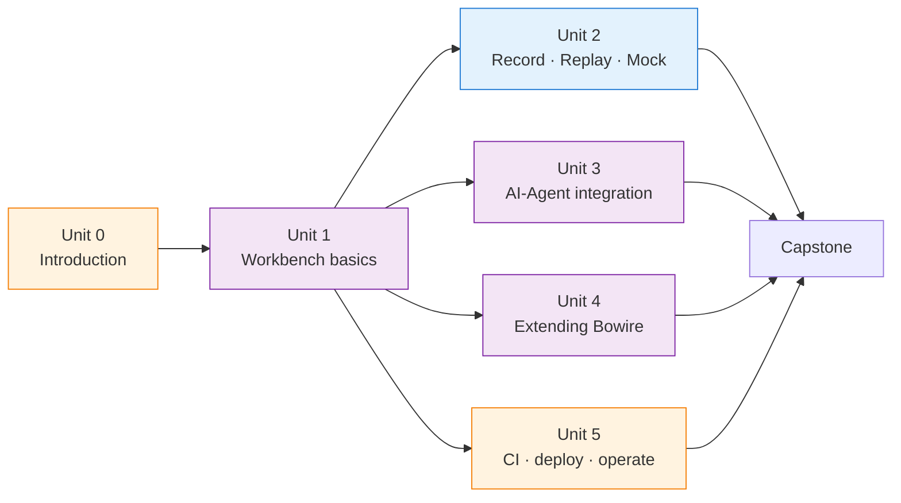

# Bowire Bootcamp — v2.1 alignment & purpose-driven-paths audit

*Date: 2026-06-30 · Reference repo: `Surgewave.Bootcamp` (36 flat units + 8 purpose paths) · Read-only audit*

This audit walks every unit / lesson under `units/` against (a) the current `unit-1-cli/` + `unit-1-embedded/` + `unit-1-samples/` shape and (b) the language Bowire v2.1.0 (released as `bb088e53` on the main repo) introduced. The deliverable is a refresh plan, not a refresh — no files are edited under `units/` here.

Out-of-scope sanity check: `capstone/` is still scaffolded scenario text + a TBD reference solution; nothing in it mentions v2.0+ terminology, so it inherits the same vocabulary gap as the units. Refresh it once the unit consolidation lands.

---

## Section 1 — Structural duplication (CLI / Embedded tracks)

### Inventory

```
units/
├── unit-0/                   shared (no track split) — 3 lessons
│   ├── lesson-1/  What is Bowire?           (shared, concept)
│   ├── lesson-2/  Setup                     (in-page Path A / Path B split)
│   └── lesson-3/  Hello Bowire              (CLI-only, embedded redirected to unit-1-embedded)
├── unit-1/                   ORPHAN — directory contains lesson-1/sample/ + lesson-2/sample/ both empty, no README
├── unit-1-cli/               CLI-only track (2 lessons + track README)
├── unit-1-embedded/          Embedded-only track (2 lessons + track README)
├── unit-1-samples/           HelloApi + HelloGrpc — shared runtime samples
├── unit-2/                   shared, 2 lessons (URL callout for track, mock = CLI-only by design)
├── unit-3/                   shared, 1 lesson (in-page Path A stdio / Path B HTTP split)
├── unit-4/                   shared, 2 lessons (in-page Path A install / Path B PackageReference split)
└── unit-5/                   shared, 1 lesson (declared CLI-only)
```

The `unit-1/` directory at the root of `units/` is left-over from the pre-track migration; both `lesson-1/sample/` and `lesson-2/sample/` are empty directories with no `README.md`. It can be deleted with no link breakage.

### Per-lesson variant + diff-size table

| Unit / lesson | Variants | Diff size | Action | Notes |
|---|---|---|---|---|
| Unit 0 / 0.1 What is Bowire? | none | n/a | KEEP as-is | Concept lesson — already covers both shapes in one page (mermaid diagrams + comparison table) |
| Unit 0 / 0.2 Setup | in-page Path A + Path B | medium (~80 lines of duplication around environment dirs + verify) | CONSOLIDATE further — add a **third audience tab** ("Administrator setup") covering systemd service / Docker / IIS host. Today both paths cover the *user* setup, neither covers the *operator* setup. | Path B uses `dotnet new web` scaffold; Path A walks `~/.bowire/` directories. Layout is fine; just incomplete. |
| Unit 0 / 0.3 Hello Bowire | CLI-only with embedded skip-ahead | n/a | KEEP CLI-only; RETARGET as a **public-API operator** lesson | Public Petstore demo is genuinely a CLI use case (no embedded host involved) — fits a "Workbench operator" audience cleanly without needing an Embedded twin |
| Unit 1 / 1.1 First call | `unit-1-cli/lesson-1` (83 lines) + `unit-1-embedded/lesson-1` (131 lines) | LARGE — setup steps 1-4 genuinely differ; verification steps 5-7 are 90 % identical (same workbench tree, same GetGreeting form, same JSON response) | CONSOLIDATE into one lesson with two tabbed setup blocks then a shared "Drive the workbench" walkthrough. The HelloApi sample is already shared in `unit-1-samples/`. | The split exists because the wire-in differs, not because the lesson does — the workbench UX is the same. After v2.1's rail strip + Compose IA the verification walkthrough should be rewritten anyway, so consolidate during that rewrite. |
| Unit 1 / 1.2 Multi-protocol (REST + gRPC) | `unit-1-cli/lesson-2` (114 lines) + `unit-1-embedded/lesson-2` (157 lines) | LARGE — co-hosting gRPC inside HelloApi is genuinely different from `--url --url` against two services. Verification steps 5-7 are 90 % identical. | CONSOLIDATE the same way as 1.1. The Embedded variant has more setup ceremony (proto include, csproj edit, `AddGrpcReflection`); show that as a `<details>` expander under the Embedded tab. | Streaming demo + response pane walkthrough = shared. The "two terminals vs one process" mental-model diagram from each track README belongs in the consolidated lesson body. |
| Unit 2 / 2.1 Record & Replay | shared with URL-callout | small (one table mapping track→URL) | KEEP shared; STRENGTHEN the v2.1 walkthrough (Workspaces, Compose rail, Recording rail) | Mock-replay is intentionally CLI-only — that part is architectural, not refresh-able |
| Unit 2 / 2.2 Schema export + mock-as-stand-in | shared | none | KEEP as-is structurally; refresh vocabulary in Section 2 | Already shape-agnostic; only words change in v2.1 |
| Unit 3 / 3.1 AI-Agent Integration | in-page Path A stdio + Path B HTTP | LARGE but cannot consolidate | KEEP the in-page split | Path A (role 4) and Path B (role 3) expose *fundamentally different MCP tool surfaces* — `bowire.discover` / `bowire.invoke` vs `HelloApi.GetGreeting` directly. This isn't a shape difference; it's two different products. Split is correct. |
| Unit 4 / 4.1 .NET protocol plugin | in-page Path A `bowire plugin install` + Path B `PackageReference` | small (Steps 5 + 6 differ; everything else shared) | KEEP in-page split; SHRINK it — the install ceremony differs but the **plugin code is identical**. Today the lesson already calls out "Path-split is narrow"; nothing to consolidate further. | The current shape (tabbed blocks inside one document) is exactly what Surgewave does for its UI-vs-API variants. Model. |
| Unit 4 / 4.2 Python sidecar plugin | in-page note that the sidecar zip lives in `~/.bowire/plugins/` regardless of shape | trivial | KEEP shared | Sidecars are shape-agnostic by construction — install once, embedded host picks it up automatically |
| Unit 5 / 5.1 GitHub Actions Integration | declared CLI-only | n/a | KEEP CLI-only; RETARGET as a **Administrator / CI-runtime** lesson | CI agents always run the CLI shape — there is no embedded host at CI time. Belongs in an Operations / Production path, not in a track |

### What cannot consolidate (intentional CLI-only or Embedded-only by design)

| Lesson | Why it cannot consolidate |
|---|---|
| Unit 0 / 0.3 Hello Bowire | Public Petstore = pointing at someone else's URL = CLI's job. The embedded shape has nothing equivalent. |
| Unit 2 / 2.1 Record & Replay (mock half) | `bowire mock` is a standalone process — embedding it alongside live routes would mix replay + live traffic in the same listener. CLI-only is the design intent. |
| Unit 3 / 3.1 Path A (stdio MCP) | Claude Desktop spawns subprocesses; no HTTP endpoint to embed. |
| Unit 3 / 3.1 Path B (HTTP MCP adapter) | `AddBowireMcpAdapter()` requires DI access — no CLI equivalent. |
| Unit 5 / 5.1 CI integration | No embedded host at CI time. |

### What can consolidate cleanly (top wins)

| Lesson | Diff | Recommended shape |
|---|---|---|
| Unit 1 / 1.1 First call | Step 1-4 setup differs; Steps 5-7 walkthrough identical | One lesson, two tabbed setup blocks (`<details>` or DocFX tabs), one shared walkthrough body. |
| Unit 1 / 1.2 Multi-protocol | Same shape as 1.1 — different setup, identical streaming-pane walkthrough. | Same — tabbed setup + shared walkthrough. |

### Verdict — Section 1

Top-3 structural priorities:

1. **Delete the empty `units/unit-1/`** stub-directory (no README, two empty `sample/` dirs). Zero-risk cleanup, no link breakage anywhere in the bootcamp.
2. **Merge `unit-1-cli/` + `unit-1-embedded/` into a single `unit-1/`** with tabbed setup blocks. The two parallel tracks duplicate the workbench-walkthrough text 90 %; only Steps 1-4 of each lesson are genuinely shape-specific. This also kills the `LEARNING_PATHS.md` "first decision: pick your deployment shape" framing the operator complains about, because the deployment shape becomes a tabbed setup choice inside a single lesson rather than a path-level branch.
3. **Rebrand Unit 0.3 + Unit 5.1 as audience-bound, not shape-bound.** Both are intentionally CLI-only today and read as "Embedded users skip this" — but they're really *operator* (Unit 0.3, public-API exploration) and *administrator* (Unit 5.1, CI integration) lessons. The audience framing is more accurate and survives the Section 3 path restructure.

---

## Section 2 — v2.1 content alignment

### Pre-v2.0 vocabulary hits (what to retire)

The bootcamp was written at v1.6 / v1.7. The most recent version anchor in the lesson bodies is the explicit `v1.7` reference in Lesson 2.2 ("workbench captures this automatically as of v1.7"). Every lesson predates the v2.0 IA rewrite and the v2.1 rail-strip rollout.

| File | Line | Quote | v2.1 replacement |
|---|---|---|---|
| `units/unit-0/lesson-2/README.md` | 88 | `\| ~/.bowire/environments.json \| Saved environments / variables (workbench UI) \|` | **`Workspaces`** is the v2.x replacement for the v1.x "environments" concept. The state file is now `~/.bowire/workspaces.json` (per workspace, not per env). Confirm exact filename in main repo before updating. |
| `units/unit-0/lesson-2/README.md` | 146 | "State (recordings, **environments**, secrets) is per-process by default" | Same — replace "environments" with "workspaces" |
| `units/unit-0/lesson-2/README.md` | 166 | "Plugins, recordings, **environments**, secrets" (Key Takeaways) | Same |
| `units/unit-2/README.md` | 25 | "frontend dev **environments**" | Ambiguous — this one refers to *deployment* environments, not Bowire workspaces. KEEP. Document the distinction explicitly though, since the v2.x reader will read "environments" as the deprecated UI concept. |
| `units/unit-0/lesson-1/README.md` | 109 | "Air-gapped or on-prem **environments**" | Same as above — deployment context, KEEP |
| (all lessons) | — | No mention of **Workspaces** anywhere | ADD a Workspaces overview to Unit 1.1 (the first lesson that uses the workbench) — the rail-strip's first stop is the workspace picker, and every recording / mock / MCP-driven session in subsequent lessons is implicitly scoped to a workspace. |
| (all lessons) | — | No mention of **Compose rail** | The Lesson 2.1 record + replay flow walks through the recording rail, but the *request* in Step 3 ("● Record → Invoke GetGreeting") is composed in the Compose rail (post-v2.1 IA). Today's lessons describe it generically ("Click GetGreeting, fill the form") — add a one-paragraph "this is the Compose rail; v2.0 used to call it Design" note in Lesson 1.1. |
| (all lessons) | — | No mention of **Help rail** | Add a "Where to find help in-product" callout in Unit 0.3 (the first hands-on lesson) since v2.1 moved Help from the drawer to its own rail. Low priority but a free win. |
| (all lessons) | — | No mention of **Interceptor consolidation** (Proxy + Intercepted + Traffic → one rail + `Kuestenlogik.Bowire.Interceptor` package) | The bootcamp never covered Proxy / Intercepted / Traffic at all — there's no migration debt here, just a coverage gap. Consider an extension lesson under the Developer audience (interceptor middleware authoring is a plugin-author topic). |
| (all lessons) | — | No mention of the **Map widget** (`Kuestenlogik.Bowire.Map`) or `coordinate.wgs84` semantic kind | Add a one-line note in Unit 4 (plugin authoring): when your protocol's payload carries `coordinate.wgs84`, the workbench auto-renders the Map widget for it. Forward-looking; not a blocker. |
| (all lessons) | — | No mention of the **Settings IA rewrite** (System settings parent, Plugins extension-point tree). Lesson 0.2 still talks about `~/.bowire/config.json` and `--config`, which are still accurate but no longer the only path | Add a one-line "or via Settings → System → Defaults" callout in Lesson 0.2. |
| (all lessons) | — | No mention of the **`Kuestenlogik.Bowire.Rail.X` → `Kuestenlogik.Bowire.X` package rename** | Important for Unit 4.1 — `Kuestenlogik.Bowire.Templates` is referenced unchanged (correct), but the *consuming* package any embedded host uses (`Kuestenlogik.Bowire`) has been split: bare `Kuestenlogik.Bowire` is now Core, with Compose / Recording / MCP-adapter / Interceptor / Map / Help as siblings. Lesson 0.2 Path B's `dotnet add package Kuestenlogik.Bowire` is still correct for the workbench default, but should mention what's pulled in transitively vs what needs an explicit `dotnet add package`. |
| `units/unit-3/lesson-1/README.md` | 105 | `builder.Services.AddBowireMcpAdapter("http://localhost:5001");` | Confirm the API survived v2.1's interceptor consolidation untouched. The MCP adapter is its own sibling package post-v2.1 (`Kuestenlogik.Bowire.Mcp` or similar) — Lesson 3.1 may need a `dotnet add package` line for the adapter that wasn't required when the embedded `Kuestenlogik.Bowire` rolled everything in. |
| `units/unit-2/lesson-2/README.md` | 12, 65, 149 | "**workbench captures this automatically as of v1.7**" | Replace with "since v1.7" with no further version-gate text — v2.1 doesn't add anything to this story; the v1.7 anchor is still factually correct. Optional: update to "since v1.7 (also covered by the v2.1 Recording-rail capture flow)" for forward-compat. |

### Screenshots / images referenced — pre-v2.0?

| Lesson | Image reference | Verdict |
|---|---|---|
| All lessons | **None** | No screenshots are inlined in any lesson body. Lesson screenshots live only in `.docfx/templates/bowire/public/images/` (the site chrome / hero), not next to the lesson text. The `ROADMAP.md` line "the screenshots in the lesson READMEs already cover the click path" is now inaccurate — there are no lesson screenshots. Add screenshots only after the v2.1 IA refresh, otherwise they will need to be reshot a second time. |

### v2.1 features mentioned at all? (Summary)

| Feature | Mentioned anywhere | Should be mentioned |
|---|---|---|
| Rail strip (vertical nav) | NO | YES — Unit 0.1 (concept), Unit 1.1 (first contact) |
| Workspaces | NO | YES — Unit 0.2 + Unit 1.1 + Unit 2.1 |
| Compose rail | NO (lessons call it "form / invoke form / right pane") | YES — Unit 1.1, name it explicitly |
| Help rail | NO | low-priority — one mention in Unit 0.3 |
| Interceptor consolidation | NO | OPTIONAL — Developer audience extension |
| Map widget / `coordinate.wgs84` | NO | LOW — one mention in Unit 4 |
| Settings IA rewrite | NO | YES — Unit 0.2 + Unit 4 (Plugins extension-point tree) |
| Package renames (`Kuestenlogik.Bowire.Rail.X` → `Kuestenlogik.Bowire.X`) | NO | YES — Unit 4.1 Path B + Unit 3.1 Path B explicitly |
| `Kuestenlogik.Bowire.Interceptor` package | NO | OPTIONAL — Developer audience |
| `Kuestenlogik.Bowire.Map` package | NO | LOW — Unit 4 forward-ref |

### Verdict — Section 2

Top-3 vocabulary priorities:

1. **`environments` → `Workspaces` everywhere it refers to the UI concept** (Lesson 0.2 explicit hits, plus implicit references in Lesson 2.1's "save the recording" flow). Do not touch "deployment environments" / "on-prem environments" — those are different words that happen to spell the same.
2. **Name the v2.1 rails explicitly in Lesson 1.1** — "Compose rail" (where the form lives), "Recording rail" (where the .bwr capture lives in Unit 2). Today the lessons describe these generically as "right pane" / "Recordings manager" — names a v2.0 user will recognise. Without rail names the v2.1 IA looks like undocumented territory.
3. **Verify the `Kuestenlogik.Bowire.X` package surface against v2.1 in Lesson 0.2 Path B + Lesson 3.1 Path B + Lesson 4.1 Path B.** Three embedded-shape `dotnet add package` calls; each one needs a second look to see whether v2.1 still bundles transitively or now requires explicit per-feature packages.

---

## Section 3 — Proposed Surgewave-style purpose-driven paths

### Proposed top-level structure

```
units/                                  ← FLAT sequence (after Section 1 consolidation)
├── unit-0/   Introduction              (1 unit, 3 lessons) — shared
├── unit-1/   Workbench basics          (1 unit, 2 lessons, merged from -cli + -embedded)
├── unit-2/   Record · Replay · Mock    (1 unit, 2 lessons)
├── unit-3/   AI-Agent integration      (1 unit, 1 lesson, in-page A/B)
├── unit-4/   Extending Bowire          (1 unit, 2 lessons)
├── unit-5/   CI · deploy · operate     (1 unit, 1 lesson today; room to grow)
└── capstone/                            (cross-audience integration)

LEARNING_PATHS.md                       ← 3 purpose-driven paths + the optional capstone:
- 1. Workbench & API operator         (User audience — UI + alt CLI, "how do I drive Bowire")
- 2. Developer / embed & extend       (Developer audience — embedding, plugins, contributions)
- 3. Administrator / deploy & run     (Admin audience — setup, deployment, CI, ops)
- 4. Capstone (optional)               (cross-audience integration project)
```

The flat unit list is the same `units/unit-0/` … `units/unit-5/` it already is on disk (after collapsing the two `unit-1-*` tracks). The paths are a *curation* on top — same model Surgewave uses for its 36 flat units overlaid by 8 paths.

### Path 1 — Workbench & API operator (User audience)

**For:** Developers, frontend engineers, QA, AI/agent operators who *use* Bowire to drive APIs. The CLI is the daily driver; the embedded shape is something they meet when their backend team uses it.

**Audience entry:** "I want to call APIs (mine or someone else's) without the API-client churn."

| # | Lesson | Why it matters | Source |
|---|---|---|---|
| 1 | Unit 0.1 — What is Bowire? | Positioning, two-shape mental model | unchanged |
| 2 | Unit 0.2 — Setup (CLI tab) | Install global tool, verify | unchanged tab |
| 3 | Unit 0.3 — Hello Bowire | First call against public Petstore | unchanged |
| 4 | Unit 1.1 — First call (CLI tab) | First call against your own service | consolidated |
| 5 | Unit 1.2 — Multi-protocol (CLI tab) | REST + gRPC side-by-side | consolidated |
| 6 | Unit 2.1 — Record & Replay | Capture, mock-as-tape | unchanged |
| 7 | Unit 2.2 — Schema export + mock-as-stand-in | Mock with the full contract attached | unchanged |
| 8 | Unit 3.1 — AI-Agent integration (Path A) | Drive Bowire from Claude Desktop | partial of 3.1 |

**Duration:** ~90 min · **Units touched:** 0, 1, 2, 3 · **Replaces** Workbench Fundamentals + Mock-as-Stand-In + AI & Automation (today's paths 1, 2, 3) — three audience-overlapping paths collapse into one.

### Path 2 — Developer / embed & extend (Developer audience)

**For:** Backend developers embedding Bowire in their own ASP.NET host, plugin authors shipping new protocols, contributors to the Bowire core. The embedded shape is the daily driver; the CLI is the verification tool.

**Audience entry:** "I want Bowire *inside* my service, and/or I want to ship something *on top of* Bowire."

| # | Lesson | Why it matters | Source |
|---|---|---|---|
| 1 | Unit 0.1 — What is Bowire? | Positioning, two-shape mental model | unchanged |
| 2 | Unit 0.2 — Setup (Embedded tab) | `AddBowire()` + `MapBowire()` | unchanged tab |
| 3 | Unit 1.1 — First call (Embedded tab) | First mount, REST | consolidated |
| 4 | Unit 1.2 — Multi-protocol (Embedded tab) | co-host gRPC | consolidated |
| 5 | Unit 3.1 — AI-Agent integration (Path B) | `MapBowireMcpAdapter()` embedded MCP | partial of 3.1 |
| 6 | Unit 4.1 — .NET protocol plugin | `IBowireProtocol`, nupkg, `PackageReference` tab | unchanged |
| 7 | Unit 4.2 — Python sidecar plugin | polyglot escape hatch, sidecar zip | unchanged |
| 8 | *(new)* Unit 4.3 — Interceptor / middleware (proposed) | `Kuestenlogik.Bowire.Interceptor` post-v2.1 — author middleware, ship a custom auth provider | NEW — fills the v2.1 coverage gap |
| 9 | *(new)* Unit 4.4 — Map widget / semantic kinds (proposed) | when your protocol carries `coordinate.wgs84`, the workbench renders the Map widget; how to opt in / register custom semantic kinds | NEW — fills the v2.1 coverage gap |

**Duration:** ~120 min · **Units touched:** 0, 1, 3, 4 · **Replaces** Plugin Author (today's path 4) and lifts ownership of the embedded variant of every lesson here.

### Path 3 — Administrator / deploy & run (Admin audience)

**For:** Platform engineers, SREs, DevOps, anyone packaging Bowire into deploys — internal-tools containers, CI runners, sidecar deploys, multi-tenant gateways.

**Audience entry:** "I need to ship Bowire into a non-laptop environment and keep it running."

| # | Lesson | Why it matters | Source |
|---|---|---|---|
| 1 | Unit 0.1 — What is Bowire? | Positioning, shapes — admins need to pick the deploy shape | unchanged |
| 2 | Unit 0.2 — Setup (Admin tab — proposed addition) | systemd / Docker / IIS host of the CLI; embedded shape gating with `IsDevelopment()` / `#if DEBUG` | NEW Path C tab inside Lesson 0.2 |
| 3 | Unit 5.1 — CI integration | `bowire test`, mock-as-service-container | unchanged |
| 4 | *(new)* Unit 5.2 — Deployment patterns (proposed) | Single-binary CLI in a sidecar container; embedded mode behind a `#if RELEASE` gate; Settings IA: System → Defaults; `Bowire:` config keys; reverse-proxy mount paths | NEW — currently a coverage gap |
| 5 | *(new)* Unit 5.3 — Observability + operations (proposed) | logs, structured output, the v2.1 Settings IA's System tree, plugin extension-point tree (where do my installed plugins live in prod) | NEW — currently a coverage gap |

**Duration:** ~75 min once the new lessons land (~25 min today, Unit 5.1 only) · **Units touched:** 0, 5 · **Replaces** Production / CI (today's path 5) and absorbs every "this is CLI-only because there's no embedded host at this point in the lifecycle" footnote currently scattered across the units.

### Path 4 — Capstone (optional, cross-audience)

**For:** Anyone who finished at least one of paths 1-3 and wants to integrate.

| # | Lesson | Why it matters |
|---|---|---|
| 1 | Capstone — Multi-Protocol API Tour | End-to-end scenario weaving recording (User), embedded mounting (Developer), CI integration (Admin) |

Unchanged from today's capstone scaffold, plus a refresh of vocabulary to match the v2.1 audit findings in Section 2.

### Cross-audience flow diagram (proposed mermaid for LEARNING_PATHS.md)



### Verdict — Section 3

Top-3 IA priorities:

1. **Replace the five role-overlapping paths in today's `LEARNING_PATHS.md` with three audience-bound paths** (Operator / Developer / Administrator) + the optional Capstone. Today's "Workbench Fundamentals" + "Mock-as-Stand-In" + "AI & Automation" are all the same audience (User) at different scopes — collapsing them removes the "which path do I pick first" confusion.
2. **The deployment shape becomes a *tab inside a lesson*, not a *path-level branch*.** Once Section 1's consolidation lands, the only place a learner ever has to pick CLI vs Embedded is inside the setup section of each lesson — which is also exactly the place where the decision actually matters. This kills the operator's chief complaint ("dauernd nach dem pfad fragen").
3. **Open two coverage tickets on the back of this**: (a) Unit 4 extension lessons for Interceptor + Map widget — both shipped in v2.1, neither is covered. (b) Unit 5 deployment-patterns + operations lessons — today's Unit 5 stops at CI, leaves systemd / Docker / IIS deploy + Settings IA operational concerns uncovered.

---

## Phase-2 follow-up backlog (out of scope for this audit; for the post-audit issue list)

| Priority | Title | Section |
|---|---|---|
| P0 | Delete `units/unit-1/` orphan directory | 1 |
| P0 | Consolidate `unit-1-cli/` + `unit-1-embedded/` into one `unit-1/` with tabbed setup | 1 |
| P0 | Rewrite `LEARNING_PATHS.md` around 3 audience-bound paths + capstone | 3 |
| P1 | Replace `environments` (the UI concept) with `Workspaces` wherever it appears | 2 |
| P1 | Name the v2.1 rails (Compose, Recording, Help) explicitly in the workbench-walkthrough lessons | 2 |
| P1 | Verify the embedded-shape `Kuestenlogik.Bowire.X` package surface in Lessons 0.2 / 3.1 / 4.1 against v2.1's package split | 2 |
| P2 | New Unit 4.3 — Interceptor / middleware authoring | 3 |
| P2 | New Unit 4.4 — Map widget / semantic kinds | 3 |
| P2 | New Unit 5.2 — Deployment patterns (systemd / Docker / IIS host, embedded gating) | 3 |
| P2 | New Unit 5.3 — Observability + operations | 3 |
| P3 | Refresh Capstone vocabulary against the v2.1 audit findings + retire the v1.x mental model | 2 / 3 |
| P3 | Add lesson screenshots once v2.1 IA refresh is final (don't reshoot twice) | 2 |

---

*End of audit.*
