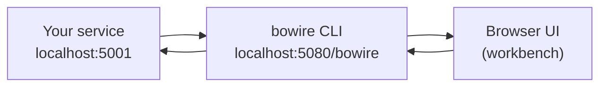

# Lesson 0.1: What is Bowire?

> **Difficulty:** Beginner | **Duration:** 10 min | **Prerequisites:** None

## Overview

Bowire is a **multi-protocol API workbench** for .NET. One tool that discovers, invokes, records, mocks, and exports APIs across REST, gRPC, GraphQL, MCP, MQTT, NATS, SignalR, WebSocket, SOAP, Pulsar — and any custom protocol you ship as a plugin. Local-first, no cloud, no account, no SaaS tier.

This lesson covers what Bowire *is*, how it positions next to the tools you've probably already used (Postman, Insomnia, Bruno), and when to pick it. The next two lessons in this unit get you installed and verify the workbench renders against a real API.

## The two-process model

You run your service on its own port. You run `bowire --url http://your-service`. The CLI boots a local browser UI on `localhost:5080/bowire` and acts as a debugger that *talks to* your service — it doesn't host or replace it.

## Why a "workbench" instead of an "API client"?

A workbench has more in mind than firing a request and inspecting the response:

| Capability | What it means in Bowire |
|---|---|
| **Discover** | Point the workbench at a server URL; every operation the server advertises (OpenAPI for REST, Server Reflection for gRPC, introspection for GraphQL, `tools/list` for MCP, &c) shows up in the sidebar automatically. |
| **Invoke** | Every method gets a form-driven invoke pane built from the schema. Unary, server-streaming, client-streaming, bidirectional — same primitive UI. |
| **Record** | One button captures every successful invocation until you click Stop. Saved as a portable `.bwr` JSON document. |
| **Replay** | `bowire mock --recording <file>` runs the recording back as a local mock server. Same wire, no real backend. |
| **Export** | `bowire export openapi <url>` round-trips a discovered surface back to a portable schema artefact. Useful for handing the contract to a different team. |
| **Mock-as-stand-in** | The recording carries the original schema verbatim; the mock re-emits it under `/openapi.json` so peer Bowires discover the *full* contract through the mock. |
| **Test** | `bowire test` runs a recording as an assertion suite. Same shape works as a CI step. |
| **AI integration** | `bowire mcp serve` exposes the toolset over MCP so an agent (Claude Desktop, Cursor, custom MCP host) can drive the workbench from a chat. |
| **Extend** | Author new protocol plugins in .NET (`IBowireProtocol`) or in any language with a polyglot sidecar SDK (Python / Rust / Node / Go). |

## Bowire vs alternatives

| Feature | Bowire | Postman | Insomnia | Bruno |
|---|---|---|---|---|
| Runtime | .NET, single binary | Desktop app (Electron) + cloud sync | Desktop app | CLI + Desktop |
| Cloud requirement | None | Account required for sync | Account for cloud features | None |
| Multi-protocol | REST + gRPC + GraphQL + MQTT + WebSocket + SignalR + Socket.IO + MCP + NATS + SOAP + Pulsar + plugins | REST + GraphQL + WebSocket + Socket.IO + MQTT (limited) | REST + GraphQL + gRPC + WebSocket | REST + GraphQL |
| Auto-discovery | Yes (per-protocol schema endpoint) | Manual collection authoring | Manual + OpenAPI import | Manual + OpenAPI import |
| Recording | Built-in | No | No | No |
| Mock server | Built-in (`bowire mock`) | Cloud mock servers (paid) | No | No |
| AI integration | Built-in (MCP server, role 4) | Postbot (LLM in the cloud) | No | No |
| Plugin model | NuGet (.NET) + sidecar (any language) | Limited | Limited | Limited |
| Pricing | Free, open source | Free tier + paid plans | Free tier + paid plans | Free, open source |

The shorter version: **Bowire is what you reach for when your stack is polyglot and you want one tool that handles every wire, locally, without a SaaS dependency.**

## When to use Bowire

### Good fit

- **Backend developers** debugging their own service across one or more wires.
- **Polyglot teams** with REST + gRPC + messaging in the same architecture.
- **Frontend developers** who want a self-contained mock backend (Unit 2).
- **QA engineers** building regression suites that replay captured traffic (Unit 5).
- **Agent / LLM builders** who want a real toolset to drive APIs from a chat (Unit 3).
- **Protocol authors** shipping a new wire on top of Bowire's plugin model (Unit 4).
- **Air-gapped or on-prem environments** where SaaS API clients are blocked.

### Consider alternatives when

- You're a single-person team working on a single REST API and Postman's free tier already covers it.
- You need browser-extension capture (Postman Interceptor) — Bowire's recording is in-workbench, not browser-side.
- Your team is heavily invested in Postman collections + Postbot AI and you don't want to migrate.

## What you'll learn in this bootcamp

- **Unit 1:** Workbench basics — point at a REST + gRPC pair, invoke, see the same UI for both wires.
- **Unit 2:** Recordings as mocks — capture a session, replay it, serve the original schema for peer discovery.
- **Unit 3:** AI-agent integration — `bowire mcp serve` into Claude Desktop / Cursor.
- **Unit 4:** Authoring plugins — once in .NET, once in Python.
- **Unit 5:** CI integration — `bowire test` and mock-as-service-container.
- **Capstone:** Multi-protocol API tour combining everything.

## Key Takeaways

1. **Bowire is a workbench, not a request runner.** Discover → invoke → record → mock → export → test → extend, all in one tool.
2. **Local-first, no cloud.** Runs on your machine, talks to your services, never phones home.
3. **Multi-protocol by design.** One UI surface, one recording format, one mock-server runtime — across REST, gRPC, GraphQL, messaging, &c.
4. **Polyglot plugin model.** New protocols ship as .NET assemblies or as polyglot sidecars in Python / Rust / Node / Go.

## What's Next

You're ready to install the `bowire` global tool and verify the bundled plugins ship correctly.

**Test your knowledge:** → [Knowledge Assessment](KNOWLEDGE_ASSESSMENT.md)
**Continue:** → [Lesson 0.2: Setup](../lesson-2/README.md)

## Reference

- [Bowire docs index](https://bowire.io/docs/)
- [Architecture overview](https://bowire.io/docs/architecture/)
- [Bowire GitHub](https://github.com/Kuestenlogik/Bowire)
