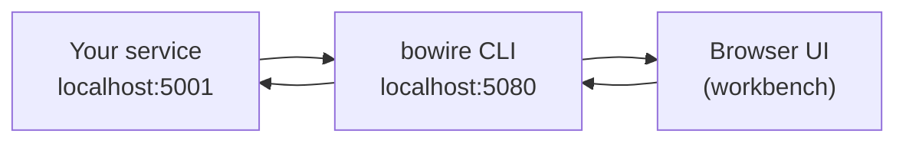
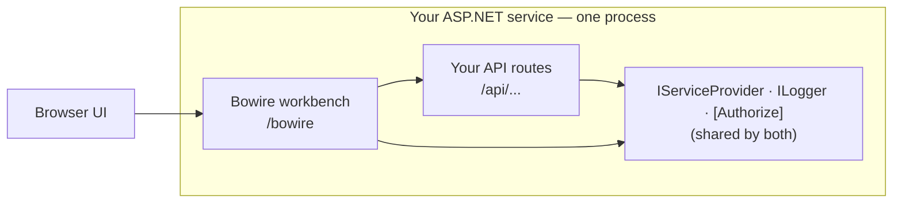

# Lesson 0.2: The two deployment shapes

> **Difficulty:** Beginner | **Duration:** 8 min | **Prerequisites:** [Lesson 0.1](../lesson-1/README.md)

## Overview

Bowire ships in two **deployment shapes**. Both expose the exact same workbench surface and the same features — they differ only in **where the workbench runs** relative to the service you're working with. This lesson is the *mental model* and the *decision criteria*. It does **not** install anything: setup steps live in the unit that matches your shape, and this bootcamp's [courses](../../LEARNING_PATHS.md) already point you at the right one.

## Two-process (standalone CLI) — point at any URL

The `bowire` CLI is a **separate process**. It boots a local browser UI and acts as a debugger that *talks to* the target service over the wire. The target can be your laptop service, a staging URL, a teammate's port-forward — anything Bowire can reach.

→ Install + first call: **[Unit 3: CLI & operations](../../unit-3/README.md)**.

## Single-process (embedded) — mount the workbench inside your service

The workbench lives **inside** your service process — same `IServiceProvider`, same `[Authorize]` policies, same `IOptions<T>` config, same logging. Discovery reads endpoint sources (gRPC reflection, OpenAPI document provider, SignalR hub registry) directly through DI — no schema round-trip, no version drift.

→ Wire-in + first mount: **[Unit 4: Embed Bowire](../../unit-4/README.md)**.

## Which shape does your work call for?

| If you… | Shape | Home unit |
|---|---|---|
| Debug **someone else's** API | CLI | [Unit 3](../../unit-3/README.md) |
| Build / debug **your own** ASP.NET service | Embedded | [Unit 4](../../unit-4/README.md) |
| Run security scans / contract exports in CI | CLI | [Unit 3](../../unit-3/README.md) |
| Ship a debug UI alongside your binary's routes | Embedded | [Unit 4](../../unit-4/README.md) |
| Drive Bowire from an AI agent across many targets | CLI (`bowire mcp serve`) | [Unit 3](../../unit-3/README.md) |
| Drive a single in-process service from an agent | Embedded + `--enable-mcp-adapter` | [Unit 4](../../unit-4/README.md) |
| Internal-tools team — inherit your auth + DI | Embedded | [Unit 4](../../unit-4/README.md) |

Most teams use **both**, in different contexts. **You don't choose a shape here** — you follow the course for your role, and each unit is written for a single shape. Where a cross-shape note helps, a unit *links* to the sibling unit rather than opening a second track inline.

## The workbench is identical across shapes

Whichever shape mounted it, the workbench UI — Discover, invoke pane, response viewer, recorder, rails — is the same. That's why the **UI walkthrough lives once** in [Unit 1: The Workbench](../../unit-1/README.md), and the CLI and embedded units link to it instead of repeating it.

## Key Takeaways

1. **Same workbench, two mounts.** CLI = external probe across the wire; embedded = an endpoint inside your host that sees your DI.
2. **Your course picks the shape, not this lesson.** Setup lives in Unit 3 (CLI) or Unit 4 (embedded).
3. **Cross-shape = a link, never an inline second track.**

## What's Next

See how the bootcamp is organised — courses, units, and how to choose yours.

**Continue:** → [Lesson 0.3: How this bootcamp works](../lesson-3/README.md)
